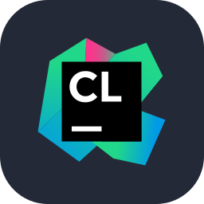
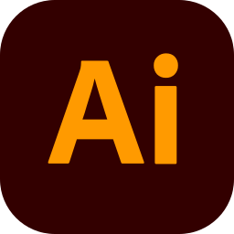

## Private Projects

linkagekinematics (kinematics solver + mechanism renderer) - complete

trussdynamics (Dynamic truss simulator with mass, spring and damper primitives.) - complete

evolution (linkage optimizer utilizing genetic and kinematics algorithm) - complete/abandoned

## Skills

    
    
    
    
    
    
    
    
    
    
    
    

